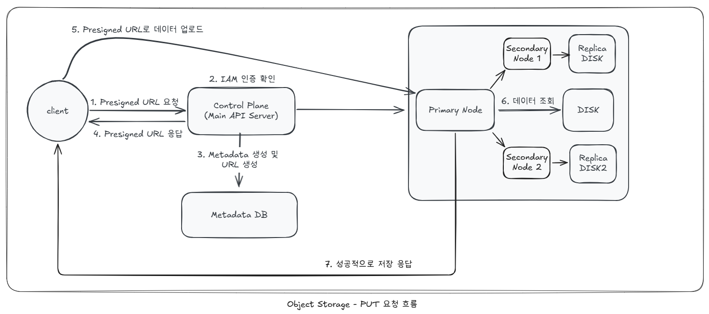
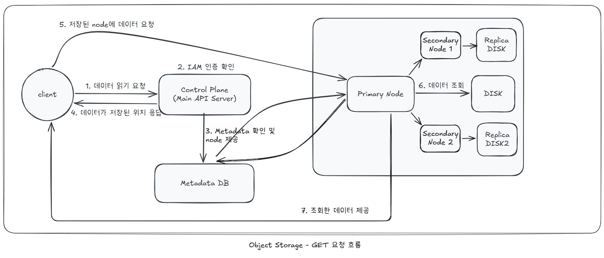

# standard-object-storage

AWS S3 object storage를 직접 만드는 프로젝트입니다.

---
## 프로토타입 아키텍처 구조도

---

## 각 요청 흐름
### 1. PUT 요청 흐름

1. Client가 Presigned URL을 요청합니다.
2. 인가된 사용자인지 확인합니다.
3. 데이터를 저장할 Metadata 및 URL을 생성합니다.
4. Client가 Presigned URL을 받습니다.
5. 해당 URL로 데이터를 업로드 합니다.
6. PrimaryNode에서 데이터를 Disk에 저장합니다.
7. 저장된 데이터를 복제합니다.

### 2. GET 요청 흐름

1. Client가 데이터를 GET 요청합니다
2. 인가된 사용자인지 확인합니다.
3. Metadata DB를 조회합니다.
4. 읽을 node 정보를 반환합니다.
5. Client에서 Primary/Replica node로 직접 요청을 보냅니다.
6. 요청을 받은 Node에서 disk를 읽습니다.
7. Node가 응답으로 데이터를 제공합니다.